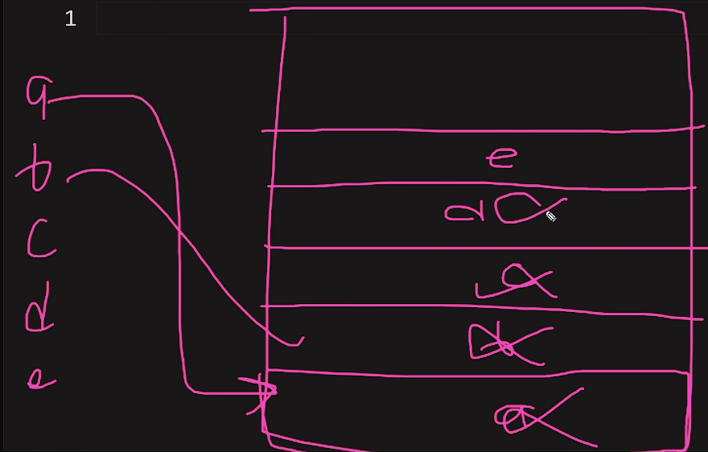

Window Object
In JavaScript, there are many features available but some of them are not present in the language itself. To use these features, we rely on the window object which is provided by the browser. The window object is like a box that we can use to access these additional features.

Browser Context Api
Browser gives us window, stack, heap that are called as BCA

Stack

Heap
All the variables or data we make they should be stored somewhere for that we have heap memory

6
3+3
1+2+3