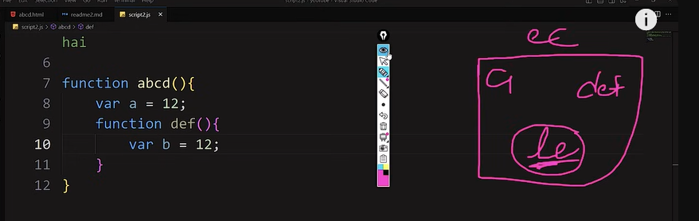

# Window Object
In JavaScript, there are many features available but some of them are not present in the language itself. To use these features, we rely on the window object which is provided by the browser. The window object is like a box that we can use to access these additional features.

# Browser Context Api
Browser gives us window, stack, heap that are called as BCA

# Stack

# Heap
All the variables or data we make they should be stored somewhere for that we have heap memory
6
3+3
1+2+3

# Execution context
EC is a container where the function's code is executed and it's created whenever a function is called, it contains 3 things variables, functions and lexical environment

# Lexical environment
A Lexical Environment is a structure that determines which variables and functions are accessible in a particular scope. It consists of two parts: a scope and a scope chain.

- How to copy a reference variable?

var a = [1,2,3,4,5]
var b = a;
b.pop(); // 1,2,3,4
a.pop(); // 1,2,3,4
Above will remove data from both the arrays

var a = [1,2,3,4,5]
var b = [...a]  // this will copy from a
b.pop(); // 1,2,3,4
a.pop(); // 1,2,3,4,5

var a = {name: "harsh"}
var copyobj = {...a}

# Callback fncs
When you write code in JavaScript, any subsequent code will execute without waiting for the previous code to complete. JavaScript will not know if the previous code is completed or not until it is finished running. This is where callback functions come in - they allow JavaScript to know when a certain task is completed and the program is ready to move on to the next task.

setTimeout(function() {
    console.log("After 2 second");
}, 2000)

# First class fncs
In Js we have one concept that means that we can use any fnc as a value.

function abcd(a){
    a()
}
abcd(function(){console.log("hello");})

- How arrays are made behind the scenes
var a = [1,2,3,4]

var a = {
    0: 1,
    1: 2,
    2: 3,
    3: 4
}

- How to delete object prop?

var a = {
    name: "tejas",
    age: 21
}

delete a.age;
delete a.name;

# Higher Order fncs
Function is getting another fnc as a value known as HOF. And also fnc is returing another fnc is also known as HOF.
Ex. forEach, setTimeout

# Constructor fncs
Inside normal fnc we use this and at the time of calling the fnc we use new keyword.
When you are in that situation when you have to use same properties again and again to make an element at that time we use constructor fncs.

function remote(color){
    this.radius = 2;
    this.color = color;
    this.pressable = true;
}

var redbtn = new remote("red");
var greenbtn = new remote("green");