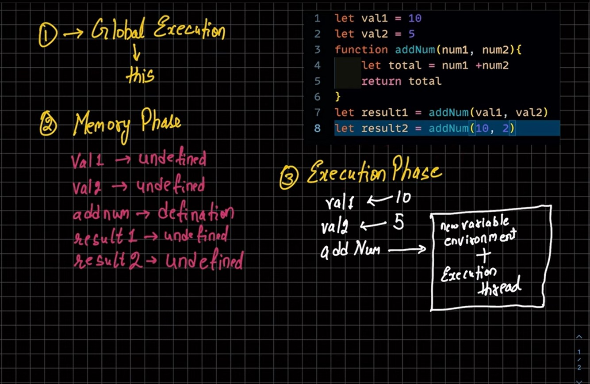
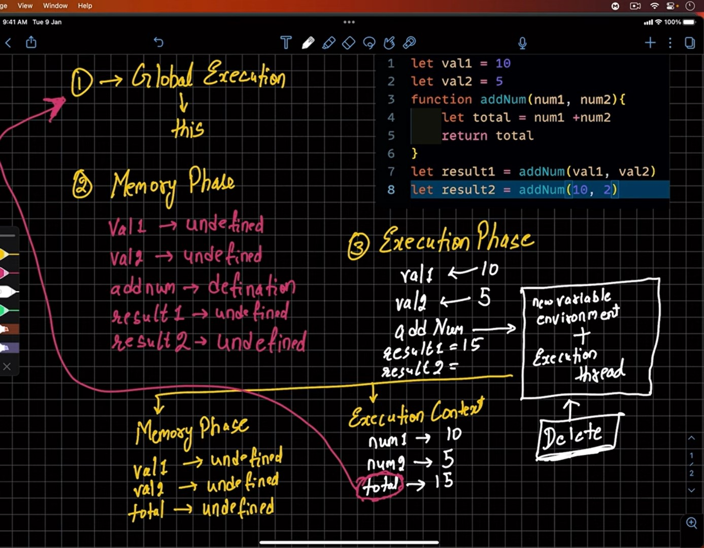
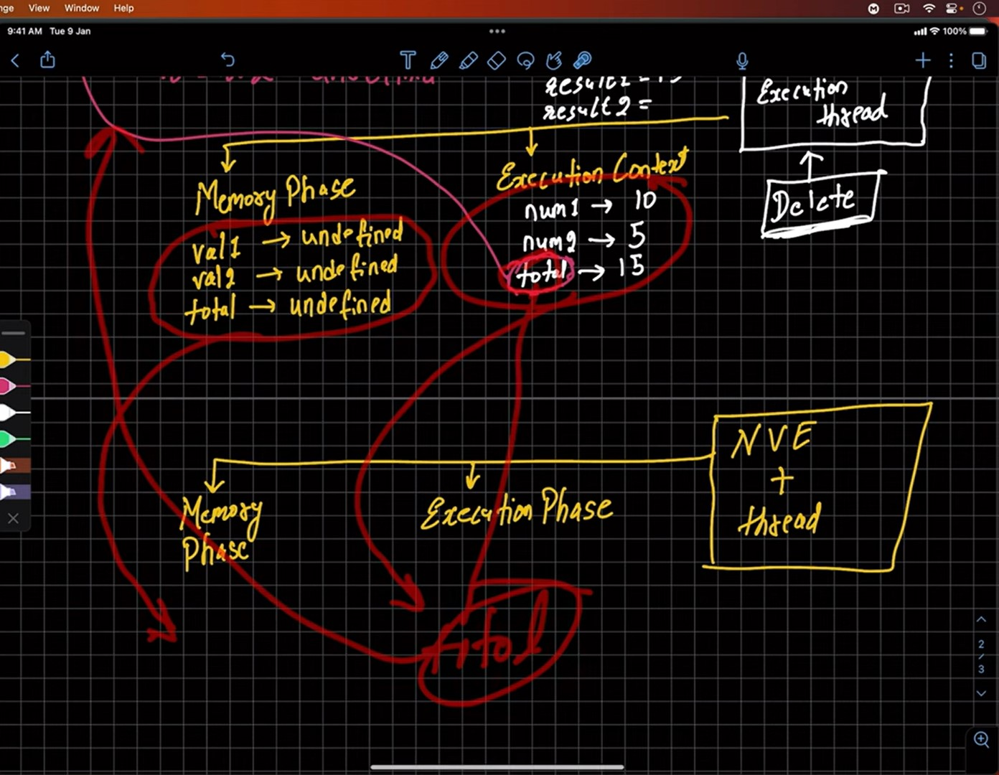
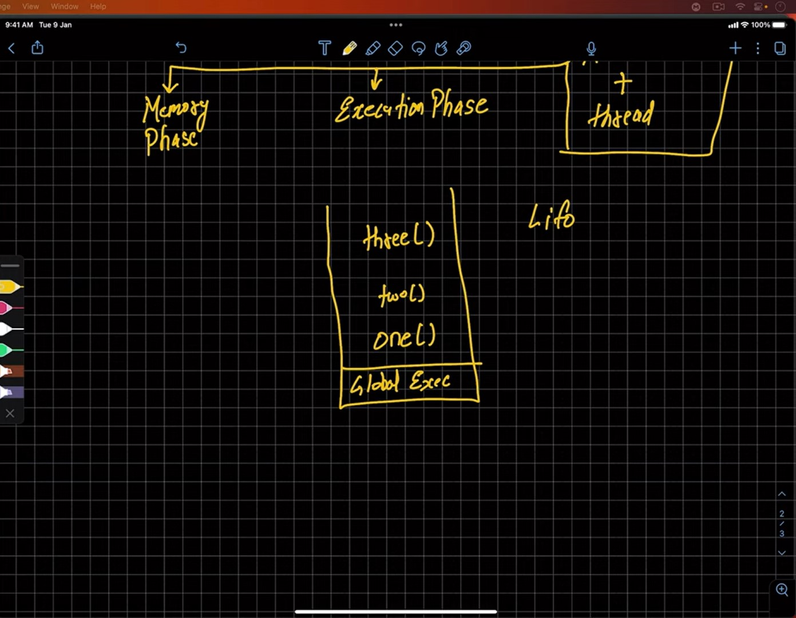
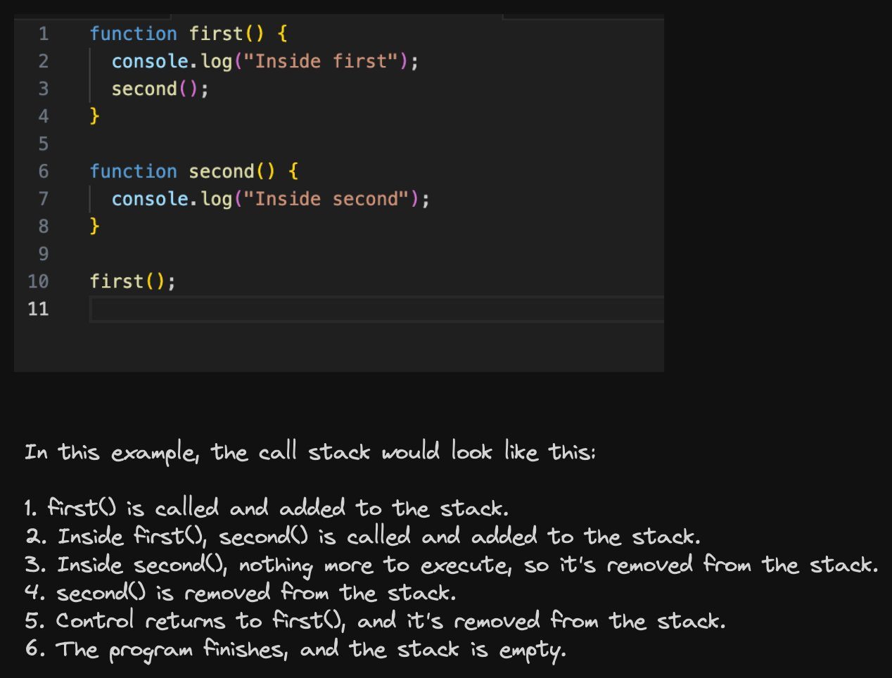

JavaScript Execution Context

{} ---> Global EC refer to this

Global Execution Context
Function Execution Contetx
Eval Execution Context ---> It is a property of global object

Exection of js code happens in 2 phases

{} --> Memory Creation Phase
   --> Execution Phase

Call Stack

The call stack is a fundamental part of JavaScript's runtime environment. 
It keeps track of the execution of functions in a synchronous, single-threaded manner.
 When a JavaScript program starts, an initial function (often the global context) is pushed onto the call stack. 
As the program runs, each function call is pushed onto the stack, and when a function completes, it's popped off the stack.

- Tracking Execution Order: 
The call stack is essential for tracking the order in which functions are called and their execution. 
When a function is invoked, it's added to the top of the stack, and when it finishes executing, it's removed.

- Function Return: 
When a function returns, it's removed from the stack, and control returns to the previous function on the stack.
This process continues until the stack is empty, indicating the program's completion.

